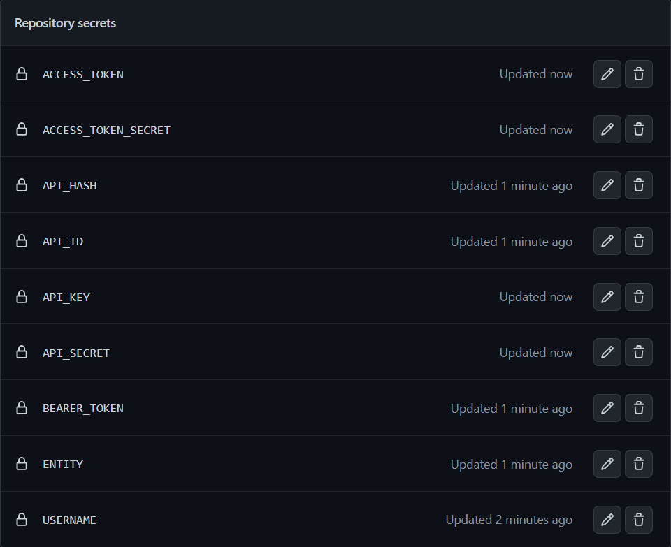

<p align="center">
    
    
    
    
    
</p>

# tweegramBot
A semi-configured respository, which help you convert your telegram messages to twitter tweets, also retweet the tweets tweeted by specific list of users.

### How to use
* Fork this repository.
* Get your API_ID and API_HASH for telegram from [here](https://my.telegram.org/apps).
* Create a python file in your local, and paste the code given below.
```python
from telethon.sync import TelegramClient

client = TelegramClient("tweegramBot", "<API_ID>", "<API_HASH>").start()
```
* Give your number and enter code you get on telegram, and that will create a `tweegramBot.session` file. Now place this `tweegramBot.session` file at the root directory of this respository you have forked.
* It is recommended to not keep the repository in public, with the `*.session`, which was created in the first step, and `*.json` file which will be created when you add users to your list.
* Get your BEARER_TOKEN, API_KEY, API_SECRET, ACCESS_TOKEN and ACCESS_TOKEN_SECRET for twitter from [here](https://developer.twitter.com/en/portal/dashboard).
* Set the API secrets you generated in the 2nd and 6th step. A total of 9 secret need to be created, which inclued 7 API secret, USERNAME (*twitter username of the bot*) and ENTITY(*telegram username for the account from which you want to transfer the text to twitter*). Learn how to create repository secrets [here](https://docs.github.com/en/actions/security-guides/encrypted-secrets).
* Secrets will look like these once setup.

    
* Once the above steps are completed, this repo will run every hour, and convert all your telegram messages into tweets. 
* *IMPORTANT*: Make sure to give `read and write permission` to github action for this repository under settings section.

### Command features you can use on telegram
```
@add <TWITTER USERNAME> => adds the user to white list.
@notice <YOUR MESSAGE> => these message will be considered as notice for telegram channel, and not be tweeted.
@remove <TWITTER USERNAME> => removes the user from white list.
```
#### Example
Command       | Twitter Tweet | Telegram message|
------------- | ------------- | ---------------|
@add [aps08__](https://twitter.com/aps08__)  | Thank you for joining us [@aps08__](https://twitter.com/aps08__).You have been added to our list with #JBDS34B34B.  | ❌
@notice Do not copy paste.  | ❌  | ❌
@remove aps08__ | ❌ | [aps08__](https://twitter.com/aps08__) tweeter user has been removed.

### Default configuration and description
You can see the Default class, which is present inside the [`src/main.py`](https://github.com/aps08/tweegramBot/blob/main/src/main.py). Now you can see what each variables mean in the below table.


Variable       | Description |
------------- | ------------- |
USERNAME | username of the twitter account, taken from the environmental variable.
FIRST_COMMENT | Default `False`, when True and if you pass a link with an image, the image will be tweeted first and the link will be tweeted in the first comment.
COMMAND_CHECK | Default `True`, when False telegram commands will not work.
FILE_NAME | Name of the json file, which stores the list of users. Default `member_info`. 
PREFIX | adds the prefix to the token for easy identification for verification. Default `GTR`.
RETWEET_TEXT | Retweet quote. We cannot create a rewteet with a quote. Default `Retweeting for better reach. \U0001F603`
ADD_MESSAGE | Tweet notification message when a user is added to the json file. Default `Thank you for joining us @{}.You have been added to our list with #{}.` Make sure to give 2 `{}` for token and twitter username for tagging, when making changes.
REMOVE_MESSAGE | Telegram notification when user is removed from the list. Default `{} tweeter user has been removed.` Make sure to pass `{}` in the string to add the username.
ONLY_IMG_MESSAGE | This Message is required when you are tweeting only an image. Default `Opening \U0001F603`.
RETWEET_MENTIONED | Default `True`, when False, the retweet functinality will not work.
SEND_LOG_ON_ERR | Default `True`, when False you won't receive the logs on telegram when there is an error or warning.

### Bad news
This project was in progress from past few weeks, so I am releasing it. The decision by twitter and API cost might affect the future of this project. Read [here](https://twitter.com/TwitterDev/status/1621026986784337922?t=AYvhqkC0gqApLV-Qw19hlA&s=19)

#### If you liked something about this repository, do give it a 🌟. It will motivate me come up with more such project. You can reach out to me on my social media given below.

<p align="center">
 <a href="https://twitter.com/aps08__"></a>
 <a href="https://medium.com/@aps08"></a>
 <a href="https://www.linkedin.com/in/aps08"></a>
 <a href="https://github.com/aps08"></a>
 <a href="https://www.youtube.com/channel/UC8biJQnoqm1s2FZ8LK90baA"></a>
 <a href="mailto:anoopprsingh@gmail.com"></a>
 <a href="https://t.me/aps080"></a>
</p>
